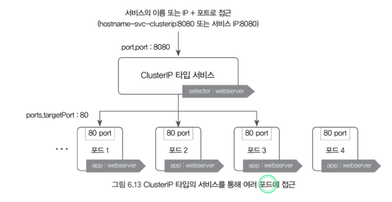
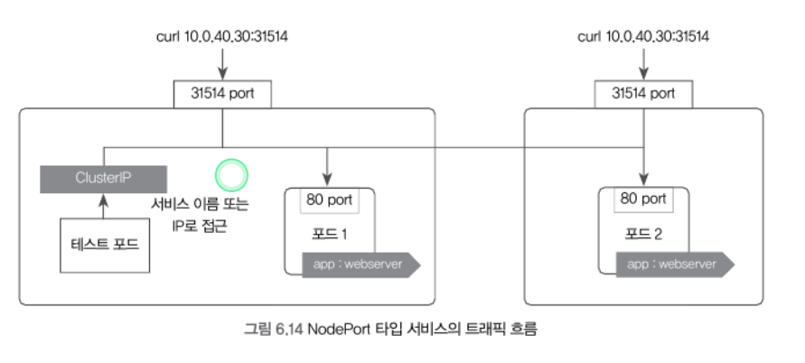
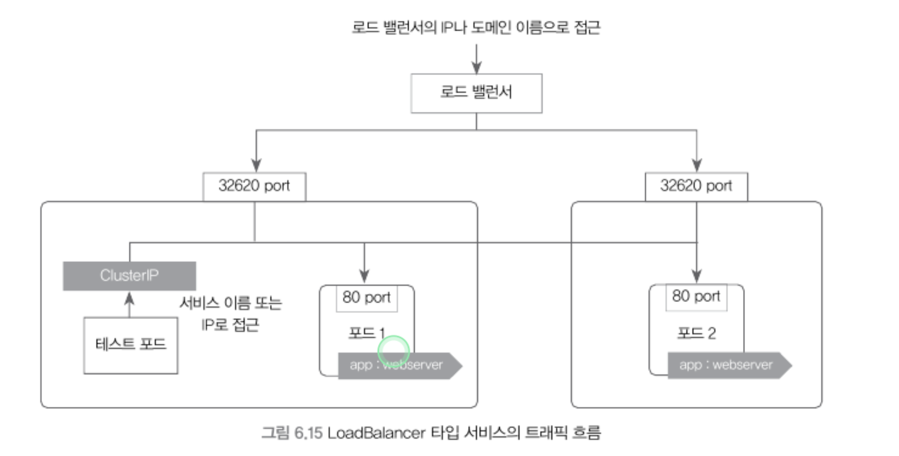
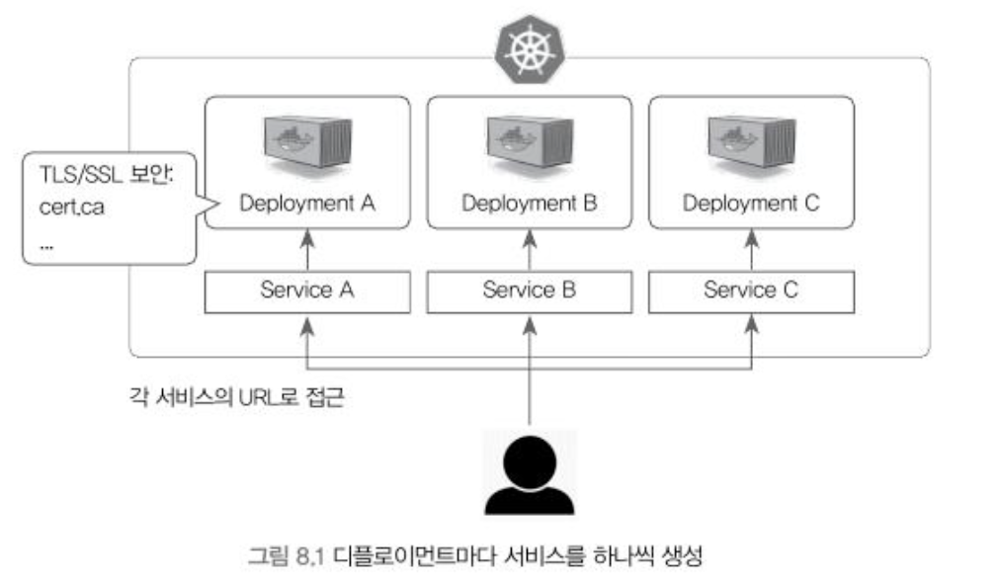
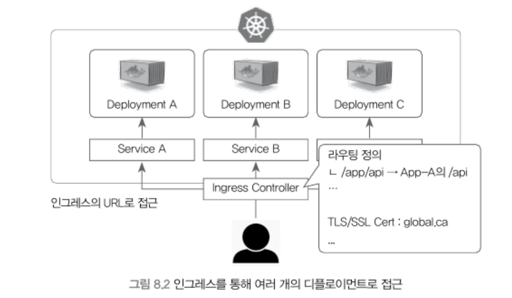
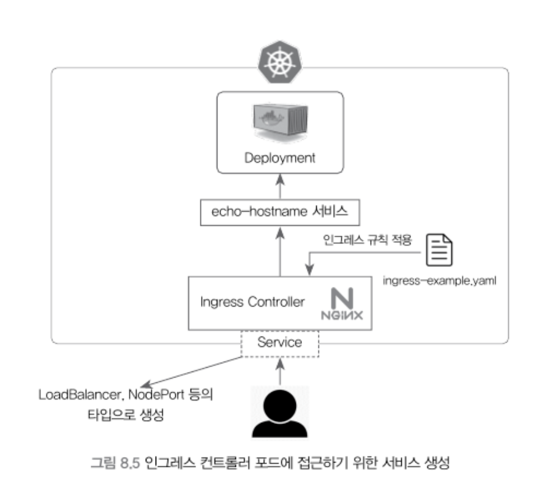
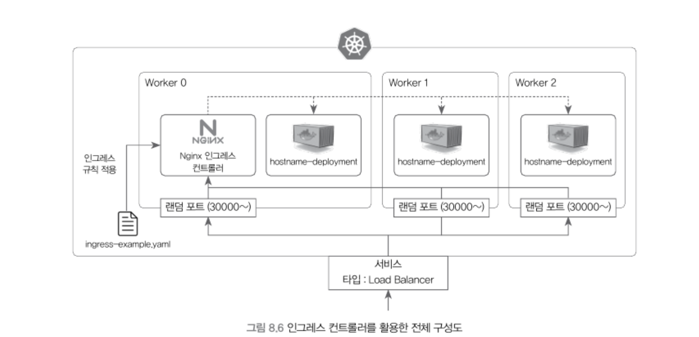

## 6.5 서비스(Service): 포드를 연결하고 외부에 노출
* 쿠버네티스는 디플로이먼트를 생성할 때 포드를 외부로 노출하지 않으며, 디플로이먼트의 YAML 파일에는 단지 포드의 애플리케이션이 사용할 내부 포트만 정의함
* 이 포트를 외부로 노출해 사용자들이 접근하거나, 다른 디플로이먼트의 포드들이 내부적으로 접근하려면서 서비스(service)라고 부르는 별도의 쿠버네티스 오브젝트를 생성해야 함
* 서비스의 핵심 기능
    * 여러 개의 포드에 쉽게 접근할 수 있도록 고유한 도메인 이름을 부여
    * 여러 개의 포드에 접근할 때, 요청을 분산하는 로드밸런서 기능을 수행
    * 클라우드플랫폼의 로드밸런서, 클러스터노드의 포트 등을 통해 포드를 외부로 노출
* cf. 쿠버네티스 설치 시 기본적으로 calico, flannel 등의 네트워크 플러그인이 사용하도록 설정되어 각 포드끼리는 통신할 수 있음

### 6.5.1 서비스(Service)의 종류

```bash
kubectl apply -f deployment-hostname.yaml --namespace ed
kubectl get pods -o wide --namespace ed

# NAME                                   READY   STATUS    RESTARTS   AGE   IP           NODE              NOMINATED NODE   READINESS GATES
# hostname-deployment-7b57c676b9-7vxrs   1/1     Running   0          27m   10.0.4.33    hrs-k8s-worker2   <none>           <none>
# hostname-deployment-7b57c676b9-gz54r   1/1     Running   0          27m   10.0.5.176   hrs-k8s-worker3   <none>           <none>
# hostname-deployment-7b57c676b9-h8b9t   1/1     Running   0          27m   10.0.13.20   hrs-k8s-worker4   <none>           <none>

kubectl run -i --tty --rm debug --image=alicek106/ubuntu:curl --restart=Never curl 10.0.5.176 | grep Hello
# <p>Hello, hostname-deployment-7b57c676b9-gz54r</p>

kubectl delete -f deployment-hostname.yaml --namespace ed
```

* ClusterIP: 쿠버네티스 내부에서만 포드들에 접근할 때 사용함. 외부로 포드를 노출하지 않기 때문에 쿠버네티스 클러스터 내부에서만 사용되는 포드에 적합함
* NodePort: 포드에 접근할 수 있는 포트를 클러스터의 모든 노드에 동일하게 개방함. 따라서 외부에서 포드에 접근할 수 있는 서비스 타입임. 접근할 수 있는 포트는 랜덤으로 정해지지만, 특정 포트로 접근하도록 설정할 수 있음
* LoadBalancer: 클라우드 플랫폼에서 제공하는 로드밸런서를 동적으로 프로비저닝해 포드에 연결함. NodePort 타입과 마찬가지로 외부에서 포드에 접근할 수 있는 서비스 타입임. 그렇지만 일반적으로 AWS, GCP와 같은 클라우드 플랫폼 환경에서만 사용할 수 있음

### 6.5.2 CLusterIP 타입의 서비스 - 쿠버네티스트 내부에서만 포드에 접근하기

```bash
kubectl apply -f hostname-svc-clusterip.yaml --namespace ed
kubectl get services --namespace ed
# NAME                     TYPE        CLUSTER-IP      EXTERNAL-IP   PORT(S)    AGE
# hostname-svc-clusterip   ClusterIP   10.101.116.44   <none>        8080/TCP   16s

❯ kubectl get services
# kubernetes 서비스는 포드 내부에서 쿠버네티스의 API에 접근하기 위한 서비스임
# NAME         TYPE        CLUSTER-IP   EXTERNAL-IP   PORT(S)   AGE
# kubernetes   ClusterIP   10.96.0.1    <none>        443/TCP   50m
```

* (생성된) 서비스의 (Cluster)IP와 포트를 통해 포드에 접근할 수 있음을 알 수 있음
* 서비스와 연결된 여러개의 포드에 자동으로 요청이 분산되고 있는 것도 볼 수 있음, 즉 별도 설정 없이도 서비스는 연결된 포드에 대해 로드 밸런싱을 수행함
* 추가적으로 쿠버네티스는 내부 DNS을 구동하고 있어 서비스 이름으로도 포드에 접근할 수 있음
    * 실제로 여러 포드가 클러스터 내부에서 서로를 찾아야 할 때 서비스의 이름과 같은 도메인 이름을 사용하는 것이 일반적임

```bash
kubectl run -i --tty --rm debug --namespace ed --image=alicek106/ubuntu:curl --restart=Never -- bash
# root@debug:/# curl 10.101.116.44:8080 --silent | grep Hello
#     <p>Hello, hostname-deployment-7b57c676b9-h8b9t</p>
# root@debug:/# curl 10.101.116.44:8080 --silent | grep Hello
#     <p>Hello, hostname-deployment-7b57c676b9-7vxrs</p>
# root@debug:/# curl 10.101.116.44:8080 --silent | grep Hello
#     <p>Hello, hostname-deployment-7b57c676b9-gz54r</p>
# root@debug:/# curl 10.101.116.44:8080 --silent | grep Hello
#     <p>Hello, hostname-deployment-7b57c676b9-h8b9t</p>
# root@debug:/# curl 10.101.116.44:8080 --silent | grep Hello
# root@debug:/# curl hostname-svc-clusterip:8080 --silent | grep Hello
#     <p>Hello, hostname-deployment-7b57c676b9-h8b9t</p>
```

* clusterIP 타입의 서비스를 생성해 포드에 접근하는 과정



1. 특정 Label을 가지는 Pod를 서비스와 연결하기 위해 서비스의 YAML 파일에 selector 항목을 정의합니다.
2. 포드에 접근할 때 사용하는 Port(포드에 설정된 containerPort)를 YAML 파일의 targetPort 항목에 정의합니다.
3. 서비스를 생성할 때, YAML 파일의 port 항목에 8080을 명시하여 서비스의 ClusterIP와 8080 포트로 접근할 수 있게 설정합니다.
4. kubectl apply 명령어로 ClusterIP 타입의 서비스가 생성되면, 서비스는 쿠버네티스 클러스터 내부에서만 사용할 수 있는 고유한 내부 IP를 할당받습니다.
5. 쿠버네티스 클러스터 내에서 서비스의 내부 IP 또는 서비스 이름으로 포드에 접근할 수 있습니다.

* 서비스의 label selector와 pod의 label이 매칭되어 연결되면 쿠버네티스는 자동으로 endpoint라고 부르는 오브젝트를 별도로 생성함.
* 자동으로 만들어져서 자세히 알 필요 없지만, 엔드포인트 자체도 독립된 쿠버네티스의 리소스이기에 이론상으로는 서비스와 엔드포인트를 따로 만드는 것도 가능함

```bash
kubectl get endpoints --namespace ed
NAME                     ENDPOINTS                                  AGE
hostname-svc-clusterip   10.0.13.20:80,10.0.4.33:80,10.0.5.176:80   18m
```

```bash
kubectl delete svc hostname-svc-clusterip --namespace ed
# kubectl delete -f hostname-svc-clusterip.yaml --namespace ed # 위와 같음
```

### 6.5.3 NodePort 타입의 서비스 - 서비스를 이용해 포드를 외부에 노출하기

* NodePort 타입의 서비스는 클러스터 외부에서도 접근할 수 있음
* NodePort 서비스는 모든 노드의 특정 포트를 개방해 서비스에 접근하는 방식임

```bash
kubectl apply -f hostname-svc-nodeport.yaml --namespace ed

# 모든 노드에서 32362 포트로 접근할 수 있음
kubectl get services --namespace ed
# NAME                    TYPE       CLUSTER-IP    EXTERNAL-IP   PORT(S)          AGE
# hostname-svc-nodeport   NodePort   10.96.26.98   <none>        8080:32362/TCP   17s

kubectl get nodes -o wide --namespace ed
# NAME              STATUS   ROLES           AGE    VERSION    INTERNAL-IP      EXTERNAL-IP   OS-IMAGE             KERNEL-VERSION       CONTAINER-RUNTIME
# hrs-k8s-ma1       Ready    control-plane   352d   v1.30.11   170.21.202.113   <none>        Ubuntu 22.04.1 LTS   5.15.0-135-generic   containerd://1.7.24
# hrs-k8s-ma2       Ready    control-plane   352d   v1.30.11   170.21.202.114   <none>        Ubuntu 22.04.1 LTS   5.15.0-135-generic   containerd://1.7.24
# hrs-k8s-ma3       Ready    control-plane   352d   v1.30.11   170.21.202.115   <none>        Ubuntu 22.04.1 LTS   5.15.0-135-generic   containerd://1.7.24
# hrs-k8s-worker1   Ready    <none>          349d   v1.30.11   170.21.202.116   <none>        Ubuntu 22.04.1 LTS   5.15.0-136-generic   containerd://1.7.24
# hrs-k8s-worker2   Ready    <none>          349d   v1.30.11   170.21.202.117   <none>        Ubuntu 22.04.1 LTS   5.15.0-136-generic   containerd://1.7.24
# hrs-k8s-worker3   Ready    <none>          349d   v1.30.11   170.21.202.118   <none>        Ubuntu 22.04.1 LTS   5.15.0-136-generic   containerd://1.7.24
# hrs-k8s-worker4   Ready    <none>          28d    v1.30.11   170.21.202.122   <none>        Ubuntu 22.04.1 LTS   5.15.0-43-generic    containerd://1.7.28

curl 170.21.202.116:32362 --silent | grep Hello
# <p>Hello, hostname-deployment-7b57c676b9-7vxrs</p>
❯ curl 170.21.202.117.114:32362 --silent | grep Hello
# <p>Hello, hostname-deployment-7b57c676b9-gz54r</p>
curl 170.21.202.118:32362 --silent | grep Hello
# p>Hello, hostname-deployment-7b57c676b9-7vxrs</p>
```


* NodePort 타입 서비스는 CLusterIP 타입 서비스의 기능을 포함하기에, NodePort 타입의 서비스를 생성하면 자동으로 CLusterIP의 기능을 사용할 수 있음

```bash
kubectl run -i --tty --rm debug --namespace ed --image=alicek106/ubuntu:curl --restart=Never -- bash
# root@debug:/# curl 10.96.26.98:8080 --silent | grep Hello
# <p>Hello, hostname-deployment-7b57c676b9-gz54r</p>
# root@debug:/# curl hostname-svc-nodeport:8080 --silent | grep Hello
# <p>Hello, hostname-deployment-7b57c676b9-gz54r</p>
```

* NodePort 트래픽 흐름



1. 외부에서 포드에 접근하기 위해 각 노드에 개방된 포트로 요청을 전송합니다. 예를 들어, 위 그림에서 31514 포트로 들어온 요청은 서비스와 연결된 포드 중 하나로 라우팅(Routing)됩니다.
2. 클러스터 내부에서는 ClusterIP 타입의 서비스와 동일하게 서비스의 내부 IP나 이름을 통해 접근할 수 있습니다.


* 기본적으로 NodePort가 사용할 수 있는 포트 범위는 30000 ~ 32767이지만, API 서버(kube-apiserver) 컴포넌트의 실행 옵션을 변경하면 원하는 포트 범위를 설정할 수 있음
* 포트 범위를 직접 지정하려면 API 서버의 옵션을 다음과 같이 추가하거나 수정 (--service-node-port-range=30000-35000)
* 너무 낮은 포트 번호는 시스템에 의해 예약된 포트일 수 있기 때문에, 가능하면 기본적으로 설정된 30000번 이상의 포트를 사용하는 것이 권장됨

* 그렇지만 실제 운영 환경에서 NodePort만으로 서비스를 외부에 직접 제공하는 경우는 많지 않음, 왜냐하면 NodePort에서 포트 번호를 80 또는 443으로 설정하기에는 적절하지 않으며, SSL 인증서 적용, 라우팅 등과 같은 복잡한 설정을 서비스에 직접 적용하기가 어렵기 때문
* 따라서 NodePort 서비스 그 자체를 통해 서비스를 외부로 노출하기보다는, 인그레스(Ingress)라고 부르는 쿠버네티스 오브젝트에서 간접적으로 사용되는 경우가 많음
* 인그레스 오브젝트는 기본적으로 외부 요청을 내부 서비스로 연결해 주는 스마트한 관문 역할을 합니다.


### 6.5.4 클라우드 플랫폼의 로드 밸런서와 연동하기 - LoadBalancer 타입의 서비스
* https://www.notion.so/khcmst/1bcd87e517f48033aa4cc9bfee138f2b?source=copy_link
* 사내 K8S에 metallb 설치되어 있음


```bash
kubectl apply -f hostname-svc-lb.yaml -n ed

kubectl get svc -n ed
# NAME                    TYPE           CLUSTER-IP      EXTERNAL-IP     PORT(S)          AGE
# hostname-svc-lb         LoadBalancer   10.111.249.66   170.22.14.80    80:31655/TCP     7s
# hostname-svc-nodeport   NodePort       10.96.26.98     <none>          8080:32362/TCP   21h

curl 170.22.14.80 --silent | grep Hello
# <p>Hello, hostname-deployment-7b57c676b9-gz54r</p

# 실제 노드 IP
# 포트는 로드밸런서의 포트이며, 이 포트는 각 노드에서 동일하게 접근할 수 있는 포트를 의미함
# 즉 아래와 같이 각 노드의 IP로 접근하면 위의 로드 밸런서와 똑같이 접근할 수 있음
curl 170.22.14.156:31655 | grep Hello
# <p>Hello, hostname-deployment-7b57c676b9-h8b9t</p>
```



1. LoadBalancer 타입의 서비스가 생성됨과 동시에 모든 워커 노드는 파드에 접근할 수 있는 랜덤한 포트를 개방합니다. 위의 예시에서는 32620 포트가 개방됨 (실습에서는 31655)
2. 클라우드 플랫폼에서 생성된 로드 밸런서로 요청이 들어오면 이 요청은 쿠버네티스의 워커 노드 중 하나로 전달되며, 이때 사용되는 포트는 1번에서 개방된 포트인 32620 포트임
3. 워커 노드로 전달된 요청은 파드 중 하나로 전달되어 처리됨

---

# 7 쿠버네티스 리소스의 관리와 설정

## 7.1 네임스페이스(Namespace): 리소스를 논리적으로 구분하는 장벽
* 네임스페이스는 포드, 레플리카셋, 디플로이먼트, 서비스 등과 같은 쿠버네티스 리소스들이 묶여 있는 하나의 가상 공간 또는 그룹이라고 이해하면 됨
* 네이스페이스는 라벨보다 더욱 더 넓은 용도로 사용됨
    * 예를 들어 특정 네임스페이스에 생성되는 포드에 항상 사이드카 컨테이너를 붙일 수 있음

```bash
kubectl get namespaces
kubectl get ns # 위와 같음

kubectl create namespace production

kubectl apply -f hostname-deploy-svc-namespace.yaml
kubecti get pods, services -n production
kubectl get pods --all-namespaces

kubectl delete namespace production
```

* 네임스페이스가 다른 경우 서비스 이름만으로는 접근할 수 없음, 이 경우 {서비스이름}.{네임스페이스이름}.svc 처럼 서비스 이름 뒤에 네임스페이스 이름을 붙이면 다른 네임스페이스의 서비스에도 접근할 수 있음

```bash
kubectl run -i --tty --rm debug --image=alicek106/ubuntu:curl --restart=Never -- bash

# pod 안에서
curl hostname-svc-nodeport.ed.svc:8080 --silent | grep Hello
# <p>Hello, hostname-deployment-7b57c676b9-gz54r</p>
```

* 네임스페이스에 종속되는 쿠버네티스 오브젝트와 독립적인 오브젝트
    * 종속되는 오브젝트 (대표)
        * 포드
        * 서비스
        * 레플리카셋
        * 디플로이먼트
    * 종속되지 않는 오브젝트 (대표)
        * 노드
        * 퍼시선트볼륨
        * 스토리지클래스

```bash
# 종속되는 오브젝트
kubectl api-resources --namespaced=true

# 종속되지 않는 오브젝트
kubectl api-resources --namespaced=false
```


## 7.2 컨피그맵(Configmap), 시크릿(Secret): 설정값을 포드에 전달

* YAML 파일에 아래와 같이 환경 변수를 직접 설정할 수도 있지만, 환경 변수만 다른 동일한 YAML파일이 필요할 수 있음 (e.g. DEV/PROD 환경)
* 이런 문제를 해결하기 위해 쿠버네티스는 YAML파일과 설정값을 분리할 수 있는 컨피그맵과 시크릿 오브젝트를 제공함
* 컨피그맵에서는 설정값을, 시크릿에서는 비밀값을 저장함

### 7.2.1 컨피그맵(Configmap)

```bash
kubectl create configmap {컨피그맵 이름} {각종 설정값들}
kubectl create configmap log-level-configmap --from-literal LOG_LEVEL=DEBUG -n ed # config1
kubectl create configmap start-k8s --from-literal k8s=kubernetes --from-literal container=docker -n ed # config2

kubectl get configmap -n ed
kubectl get cm -n ed # 위와 같음

kubectl describe configmap log-level-configmap -n ed
kubectl describe cm start-k8s -n ed
# Name:         start-k8s
# Namespace:    ed
# Labels:       <none>
# Annotations:  <none>

# Data
# ====
# container:
# ----
# docker

# k8s:
# ----
# kubernetes


# BinaryData
# ====

# Events:  <none>

kubectl get cm start-k8s -o yaml -n ed
# apiVersion: v1
# data:
#   container: docker
#   k8s: kubernetes
# kind: ConfigMap
# metadata:
#   creationTimestamp: "2026-03-13T01:23:17Z"
#   name: start-k8s
#   namespace: ed
#   resourceVersion: "91919249"
#   uid: cdf891b7-47c6-4b32-a38e-59cba7a63687
```

* 컨피그맵을 포드에서 사용하는 방법은 크게 2가지임
    1. 컨피그맵의 값을 컨테이너의 환경 변수로 사용
        * 컨피그맵에 저장된 키-값 데이터가 컨테이너의 환경 변수의 키-값으로 그대로 사용됨, 따라서 echo ${키} 방식으로 확인 가능
    2. 컨피그맵의 값을 포드 내부의 파일로 마운트해 사용
* cf. 실제 운영 환경에서는 대부분의 경우 디플로이먼트를 사용, 예시에서는 대부분 포드(Kind: Pod)를 정의하는 YAML 파일을 기준으로 설명되지만, 포드를 사용하는 다른 오브젝트들(e.g. 디플로이먼트, 스테이트풀셋, 데몬셋)도 모두 포드를 기본단위로 사용하기에 컨피그맵을 동일하게 설정할 수 있음

* 1. 컨피그맵의 값을 컨테이너의 환경 변수로 사용

```bash
kubectl apply -f all-env-from-configmap.yaml -n ed
kubectl exec -n ed container-env-example -- env
...
LOG_LEVEL=DEBUG
container=docker
k8s=kubernetes

kubectl apply -f selective-env-from-configmap.yaml -n ed
kubectl exec -n ed container-selective-env-example -- env | grep ENV
ENV_KEYNAME_1=DEBUG
ENV_KEYNAME_2=kubernetes
```

* 2. 컨피그맵의 값을 포드 내부의 파일로 마운트해 사용

```bash
kubectl apply -f volume-mount-configmap.yaml -n ed
kubectl exec -n ed configmap-volume-pod -- ls /etc/config
# container
# k8s
kubectl exec -n ed configmap-volume-pod -- cat /etc/config/k8s
# kubernetes

# pod 내부에서 살펴보기
kubectl exec -n ed -it configmap-volume-pod -- sh

/etc/config # ls
# container  k8s
cat container
# docker
cat k8s
# kubernetes


kubectl apply -f selective-volume-configmap.yaml -n ed
kubectl exec -n ed selective-cm-volume-pod -- ls /etc/config
# k8s_fullname
```

* 컨피그맵을 볼륨으로 올릴 때는 대부분 설정 파일 그 자체를 컨피그맵으로 사용함, 이때는 `--from-file` 옵션을 사용함

```bash
kubectl create configmap {컨피그맵 이름} --frome-file {파일 이름}

echo Hello, World! >> index.html
kubectl create configmap index-file --from-file index.html -n ed
kubectl describe configmap index-file -n ed
# Name:         index-file
# Namespace:    ed
# Labels:       <none>
# Annotations:  <none>

# Data
# ====
# index.html:
# ----
# Hello, World!


# BinaryData
# ====

# Events:  <none>
```

* 파일로부터 컨피그맵을 생ㄷ성할 떄는 파일 내용에 해당하는 키의 이름을 직접 지정할 수 있음

```bash
# index.html 파일 내용에 대응하는 키의 이름으로 myindex를 지정
kubectl create configmap index-file-customkey --from-file myindex=index.html
```

* `--from-env-file`을 활용하면 여러 개의 키-값 형태의 내용으로 구성된 설정 파일을 한꺼번에 컨피그맵으로 가져올 수 있음

```bash
kubectl create configmap from-envfile --from-env-file multiple-keyvalue.env -n ed
kubectl get cm from-envfile -o yaml -n ed
# apiVersion: v1
# data:
#   mykey1: myvalue1
#   mykey2: myvalue2
#   mykey3: myvalue3
# kind: ConfigMap
# metadata:
#   creationTimestamp: "2026-03-13T02:05:00Z"
#   name: from-envfile
#   namespace: ed
#   resourceVersion: "91927004"
#   uid: a9524af7-9c11-49eb-bf97-b48a8e354674
```

* 당연히 YAML로도 Configmap은 만들 수 있음

```bash
# --dry-run과 -o yaml 옵션을 사용하면 컨피그맵을 생성하지 않은 채로 YAML 파일의 내용을 출력할 수 있음
kubectl create configmap my-configmap --from-literal mykey=myvalue --dry-run -o yaml -n ed
# apiVersion: v1
# data:
#   mykey: myvalue
# kind: ConfigMap
# metadata:
#   name: my-configmap
#   namespace: ed
```

* 키-값 데이터가 너무 많아질 경우 YAML 파일이 너무 길어져 `kustomize` 기능을 활용함

### 7.2.2 시크릿(Secret)

* SSH 키, 비밀번호 등과 같이 민감한 정보를 저장하기 위한 용도로 사용됨


```bash
kubectl create secret generic my-password --from-literal password=1q2w34r -n ed

echo mypassword > pw1 & echo yourpassword > pw2
kubectl create secret generic our-password --from-file pw1 --from-file pw2 -n ed # 파일에서 생성 가능

kubectl get secrets -n ed
# NAME           TYPE     DATA   AGE
# my-password    Opaque   1      13s
# our-password   Opaque   2      2s

kubectl describe secret my-password -n ed
# Name:         my-password
# Namespace:    ed
# Labels:       <none>
# Annotations:  <none>

# Type:  Opaque # default로 설정되는 가장 일반적인 종류

# Data
# ====
# password:  7 bytes

kubectl get secret my-password -o yaml -n ed
# apiVersion: v1
# data:
#   password: MXEydzM0cg== #base64로 인코딩된 값임
# kind: Secret
# metadata:
#   creationTimestamp: "2026-03-13T03:41:13Z"
#   name: my-password
#   namespace: ed
#   resourceVersion: "91944699"
#   uid: e1c7cf73-5cf8-4a2a-a66f-45da6579a6c9
# type:

echo MXEydzM0cg== | base64 -d
# 1q2w34r

kubectl create secret generic \
my-password --from-literal password=1q2w34r \
--dry-run -o yaml
# my-password --from-literal password=1q2w34r \
# --dry-run -o yaml
# W0313 12:43:17.245513   79338 helpers.go:719] --dry-run is deprecated and can be replaced with --dry-run=client.
# apiVersion: v1
# data:
#   password: MXEydzM0cg==
# kind: Secret
# metadata:
#   name: my-password

kubectl apply -f selective-mount-secret.yaml -n ed
kubectl exec -n ed selective-volume-pod -- cat /etc/secret/password1
```

* 레지스트리 인증을 위한 방법

```bash
# 파일을 통해
kubectl create secret generic registry-auth \
--from-file=.dockerconfigison=/root/.docker/config.json \
--type=kubernetes. io/dockerconfigjson

# 직접 명시
kubectl create secret docker-registry registry-auth-by-cmd \
--docker-username=alicek106 \
--docker-password=1q2w3e4r

# 사설 레지스트리 사용하는 경우
kubectl create secret docker-registry registry-auth-registry \
--docker-username=alicek106 \
--docker-password=coin200779 \
--docker-server=alicek106.registry.com # 사설 레지스트리 주소/도메인
```

* TLS 키를 저장할 수 있는 tls 타입의 시크릿

```bash
openssl req -new -newkey rsa:4096 -days 365 -nodes \
-x509 -subj "/CN=example.com" -keyout cert.key -out cert.crt # 테스트용 키 페어 생성

kubectl create secret tls my-tls-secret --cert cert.crt --key cert.key -n ed

kubectl get secrets my-tls-secret -n ed
# NAME            TYPE                DATA   AGE
# my-tls-secret   kubernetes.io/tls   2      10s
```

* 좀 더 쉽게 컨피그맵과 시크릿 리소스 배포하기
* YAML에 작성하기보다는 kustomize(kubectl 1.14 부터 사용 가능) 쓰는 것이 권장됨

```bash
# 그러나 YAML 파일에 직접 시크릿 데이터를 저장하는 것은 바람직하지 않음
# kubectl create secret tls my-tls-secret --cert cert.crt --key cert.key --dry-run -o yaml # 권장 X

kubectl kustomize ./ -n ed

kubectl apply -k ./ -n ed
kubectl delete -k ./ -n ed
```

* 컨피그맵이나 시크릿을 업데이트하기
    * kubectl edit 명령어로 수정
    * YAML 파일을 변경한 뒤 다시 kubectl apply 명령어 사용
    * kubectl patch 명령어도 존재
* 환경 변수로 포드 내부 설정값을 한 경우 컨피그맵이나 시크릿의 값을 변경해도 자동으로 설정되지 않으며, 포드를 재생성해야함
* 파일로 포드 내부에 마운트된 설정 파일의 경우, 파일의 내용은 자동으로 갱신됨, 그러나 어플리케이션의 설정이 자동으로 변경되는 것은 아니며, 이는 개발자의 몫임


## KHC ConfigMap & Secret
* https://www.notion.so/khcmst/Airflow-21bd87e517f480a7acfdf70736ddcbed?source=copy_link
* https://github.com/khc-dp/hrs-data-deploy/blob/develop/3.restart.sh

---

# 8 인그레스
* 인그레스는 외부 요청을 어떻게 처리할 것인지 네트워크 7계층 레벨에서 정의하는 쿠버네티스 오브젝트임
* 인그레스 오브젝트가 담당할 수 있는 기본적인 기능은 다음과 같음
    * 외부 요청의 라우팅: /apple, /apple/red 등과 같이 특정 경로로 들어온 요청을 어떠한 서비스로 전달할지 라우팅 규칙을 설정할 수 있음
    * 가상 호스트 기반의 요청 처리: 같은 IP에 대해 다른 도메인 이름으로 요청이 도착했을 때, 어떻게 처리할 것인지 정의할 수 있음
    * SSL/TLS 보안 연결 처리: 여러 개의 서비스로 요청을 라우팅할 때, 보안 연결을 위한 인증서를 쉽게 적용할 수 있음

## 8.1 인그레스를 사용하는 이유
* 만약 애플리케이션이 3개의 디플로이먼트로 생성되어 있는 상황에서 각 디폴로이먼트를 외부에 노출해야 한다면 NodePort 또는 LoadBalancer 서비스를 3개 생성하는 방법(즉, 각 디플로이먼트에 대응하는 서비스를 만든 방법)이 존재함
* 이렇게 구성할 경우 서비스마다 세부적인 설정을 할 때 추가적인 복잡성이 발생하게 됨. 가령 라우팅 등을 구현하려면 각 서비스와 디플로이먼트에 대해 일일이 설정을 해야 함
* 인그레스를 사용할 경우 URL 엔드포인트 단 한개로 이러한 번거로움을 해결할 수 있음
* 즉, 아래 그림 8.2에서 볼 수 있는 것과 같이 클라이언트는 인그레스의 URL로만 접근하며, 해당 요청은 이 인그레스에 정의한 규칙에 따라 적절한 디플로이먼틔 포드로 전달됨.
* 이 과정에서 중요한 점은 라우팅 정의나 보안 연결 등과 같은 세부 설정은 서비스와 디플로이먼틀가 아닌 인그레스에서만 수행된다는 점임

* 인그레스가 없는 경우



* 인그레스가 있는 경우




## 8.2 인그레스의 구조



```bash
kubectl get ingress
kubectl get ing # 위와 같음

kubectl apply -f https://raw.githubusercontent.com/kubernetes/ingress-nginx/controller-v1.8.2/deploy/static/provider/cloud/deploy.yaml
# namespace/ingress-nginx created
# serviceaccount/ingress-nginx created
# serviceaccount/ingress-nginx-admission created
# role.rbac.authorization.k8s.io/ingress-nginx created
# role.rbac.authorization.k8s.io/ingress-nginx-admission created
# clusterrole.rbac.authorization.k8s.io/ingress-nginx configured
# clusterrole.rbac.authorization.k8s.io/ingress-nginx-admission configured
# rolebinding.rbac.authorization.k8s.io/ingress-nginx created
# rolebinding.rbac.authorization.k8s.io/ingress-nginx-admission created
# clusterrolebinding.rbac.authorization.k8s.io/ingress-nginx configured
# clusterrolebinding.rbac.authorization.k8s.io/ingress-nginx-admission configured
# configmap/ingress-nginx-controller created
# service/ingress-nginx-controller created
# service/ingress-nginx-controller-admission created
# deployment.apps/ingress-nginx-controller created
# job.batch/ingress-nginx-admission-create created
# job.batch/ingress-nginx-admission-patch created
# Warning: resource ingressclasses/nginx is missing the kubectl.kubernetes.io/last-applied-configuration annotation which is required by kubectl apply. kubectl apply should only be used on resources created declaratively by either kubectl create --save-config or kubectl apply. The missing annotation will be patched automatically.
# ingressclass.networking.k8s.io/nginx configured
# Warning: resource validatingwebhookconfigurations/ingress-nginx-admission is missing the kubectl.kubernetes.io/last-applied-configuration annotation which is required by kubectl apply. kubectl apply should only be used on resources created declaratively by either kubectl create --save-config or kubectl apply. The missing annotation will be patched automatically.
# validatingwebhookconfiguration.admissionregistration.k8s.io/ingress-nginx-admission configured

kubectl get pods,deployment -n ingress-nginx
# NAME                                            READY   STATUS      RESTARTS   AGE
# pod/ingress-nginx-admission-create-hhkg2        0/1     Completed   0          70s
# pod/ingress-nginx-admission-patch-nqpjj         0/1     Completed   2          70s
# pod/ingress-nginx-controller-7b967458dd-tp98t   1/1     Running     0          70s

# NAME                                       READY   UP-TO-DATE   AVAILABLE   AGE
# deployment.apps/ingress-nginx-controller   1/1     1            1           70s

kubectl get svc -n ingress-nginx
# NAME                                 TYPE           CLUSTER-IP      EXTERNAL-IP   PORT(S)                      AGE
# ingress-nginx-controller             LoadBalancer   10.97.12.131    170.22.14.80     80:32672/TCP,443:32747/TCP   91s
# ingress-nginx-controller-admission   ClusterIP      10.99.219.135   <none>        443/TCP                      91s

kubectl apply -f ingress-example-k8s-latest.yaml -n ed

curl --resolve ed.example.com:80:170.22.14.80 ed.example.com/echo-hostname
# <!DOCTYPE html>
# <meta charset="utf-8" />
# <link rel="stylesheet" type="text/css" href="/static/css/login.css">
# <link rel="stylesheet" href="https://maxcdn.bootstrapcdn.com/bootstrap/3.3.2/css/bootstrap.min.css">

# <div class="form-signin">
#   <blockquote>
#     <p>Hello, hostname-deployment-7b57c676b9-h8b9t</p>
#   </blockquote>
# </div>
```

* 인그레스 컨트롤러의 동작 원리 이해



* metallb가 설치되어 있는 환경이였음
* ingress-example.yaml 대신에 ingress-example-k8s-latest.yaml 사용함
* 인그레스 사용 방법 정리
    1. 공식 깃허브에서 제공하는 YAML 파일로 Nginx 인그레스 컨트롤러 생성, 이 때 Nginx 인그레스 컨트럴로를 외부로 노출하기 위한 서비스 생성됨
    2. 요청 처리 규칙을 정의하는 인그레스 오브젝트 생성
        * 인그레스 오브젝트가 생서되면 인그레스 컨트롤러는 자동으로 인그레스를 로드해 Nginx 웹 서버에 적용함
        * 이를 위해 Nginx 인그레스 컨트롤러는 항상 인그레스 리소스의 상태를 지켜보며, 기본적으로 모든 네임스페이스의 인그레스 리소스를 읽어와 규칙을 적용함
* Nginx 인그레스 컨트롤러 들어온 요청은 인그레스 규칙에 따라 적절한 서비스로 전달됨
    * 구체적으로 특정 경로와 호스트 이름으로 들어온 요청은 인그레스에 정의된 규칙에 따라 서비스로 전달됨
    * /echo-hostname이라는 경로로 들어온 요청은 hostname-svc-nodeport라는 서비스의 80번 포트르 전달됨
    * 하지만 요청이 실제로 hostname-svc-nodeport라는 서비스로 전달된 것은 아니며, Nginx 인그레스 컨트롤러는 서비스에 의해 생성된 엔드포인트로 요청을 직접 전달함
    * 즉, 서비스의 NodePort가 아닌 엔드포인트의 실제 종작 지점들로 요청이 전달되는 셈이며, 이는 쿠버네티스에서 바이패스라고 부름

```bash
kubectl get endpoints -n ed
NAME                    ENDPOINTS                                  AGE
hostname-svc-nodeport   10.0.13.20:80,10.0.4.33:80,10.0.5.176:80   17h
```

## 8.3 인그레스의 세부 기능 : annotation을 이용한 설정

```bash
kubectl apply -f ingress-rewrite-target.yaml -n ed
```


## KHC Ingress
* https://www.notion.so/khcmst/ingress-controller-1d6d87e517f480d8be82ff1f45a28a0f?source=copy_link
* https://www.notion.so/khcmst/Ingress-Proxy-DNS-222d87e517f480008423e15ee817a639?source=copy_link